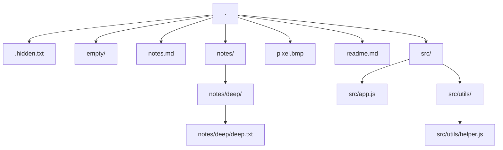

# map_folder_full.md — the FULL structure of C:\Users\connessn\Observation_only\test_trees\sample as one mermaid graph

Human AND machine readable: ONE node per folder and per file of the working
folder (label = the path relative to the working folder, "." = the working
folder, folders carry a "/" suffix), ONE edge per parent → child link.
It contains ALL folders and files — everything, not only the working folder —
and can be LARGE: do not read it whole, have a SUBAGENT read it and hand back
the paths of interest.

6 folder(s) mapped · 7 file(s) mapped

